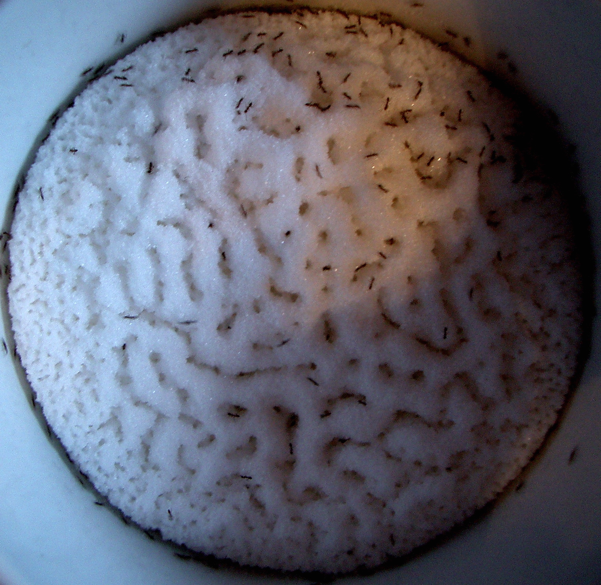
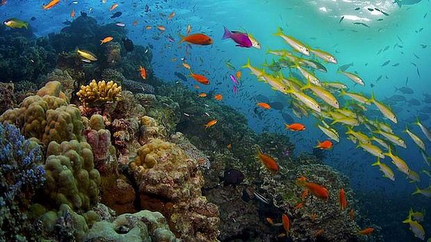

# nature's best practices for distributed systems

## hi

i'm [Mikey (@ahdinosaur)](http://dinosaur.is) from [Enspiral](http://enspiral.com)

  
  

slides are available at <http://dinosaur.is/campjs-vii>.

???

first time presenting at a conference.

i will use imprecise terminology.

## overview

- introduction to systems
- popular distributed systems
- natural distributed systems
- local distributed systems

## introduction to systems

### systems 101

- networks: who you connect to
- messages: what you say
- signaling: how you connect

examples: 

- ecological systems
- socio-economic systems
- political systems

???

### coordination problems

a [coordination problem](http://www.raikoth.net/libertarian.html#coordination_problems) is where:

- everyone agrees that certain actions would be best
- not everyone is coordinated in taking those actions

example: climate change

???

distributed systems can be seen as attempts to solve coordination problems.

a useful frame for understanding how good a distributed system is: "does it coordinate well?"

every intelligent person knows climate change is a problem to be solved.

yet we're not doing enough to solve it.

so maybe our current social / political / economic system is not a good distributed system.

### why nature?

nature is better at distributed systems than we are.

???

life is hard to kill: try killing the fungus spores in your fridge.

there's no question that the planet will survive climate change,

the question is whether we will.

### [stigmergy](https://en.wikipedia.org/wiki/Stigmergy)

central planning and control is a common solution to coordination problems.

yet biological systems coordinate:

- without central control
- under severe constraints

???

contraints like:

- energy conservation
- limited communication range
- limited messaging language
- ...

keep this biogical principle in mind.

## popular distributed networks

### [example: internet service providers](http://research.dyn.com/2010/11/chinas-18-minute-mystery/)

the Internet is fragile, take for example the Border Gateway Protocol.

malicious or incompetent ISPs can and have blackholed the Internet.

even Twitter feed of hijacks: [@bgpstream](https://twitter.com/bgpstream)

???

> [The very fabric of the Internet can be torn apart by a malicious ISP or even an honest mistake. On April 8th, 2010, an employee at China Telecom misconfigured a router - causing widespread Internet outages lasting up to fifteen minutes.](https://docs.meshwith.me/project-goals.html)

- Border Gateway Protocol
- any organization on the internet can send out a BGP message to its neighbors that says "hey, i own these IP addresses"
- the neighbors can choose to believe it or not
- good and diligent neighbors check for accuracy, but easy to pass checks
- if believed by enough neighbors, the entire internet can be blackholed in mere seconds
- the Internet has too few nodes, all our eggs are in one basket

### example: name registries

DNS is a central name registry.

Namecoin distributes registration, but not the registry.

???

- how do we deal with multiple nicknames in real life?

### example: mobile network providers

i have phone with a radio, you have phone with a radio, we can't connect because a base station is down.

peer -> middleman (provider) -> peer

???

this pattern comes up way too often.

- sharing economy (aka renting economy)
  - examples: Uber, Airbnb
- peers are at mercy of middleman

### example: buying a bicycle with Bitcoin

let's say i'm buying a bicycle from a neighbor.

with Bitcoin, i have to send a message to random strangers (miners) to participate in a global consensus process.

???

- cost of Bitcoin global consensus is large amounts of duplicate CPU work in Proof-of-Work cycles
- i'm within a very few degrees of trust separation from my neighbor, we could be doing local consensus

<https://blog.dinosaur.is/global-vs-local-systems/>

### example: twitter abuse

since everyone is connected to everyone, there's no barrier to abusing someone on Twitter.

???

- open by default
- the victim (defender) is the one who has to expend energy rather than offender.
- also easy to spam email and distributed hash tables

### example: downloading a file with Bittorrent

when i download a file with Bittorrent, i connect to random strangers.

this means it's easy to monitor who is downloading what.

### example: monoculture

the world is converging on a uniform culture, at the expense of diversity.

- what narratives and metaphors do you use to express your world view?
- how might these bias or blind your thinking?

???

- global socio-economic system: eggs all in one basket again
- diversity is dying:
  - endangered animals
  - [endangered languages](https://github.com/RichardLitt/endangered-languages)
- [technical debt of the west](http://www.meltingasphalt.com/technical-debt-of-the-west/)

## natural distributed systems

### simple over complex

???

rather than sophisticated synchronous protocols (like the OAuth dance),

most natural systems communicate with simple asynchronous messages

- beeps (unary messages)
- little to no stored memory
- one-two-many principle (count up to a threshold)

### [stochastic](https://en.wikipedia.org/wiki/Stochastic)

???

> A [stochastic](https://en.wikipedia.org/wiki/Stochastic) event or system is one that is unpredictable due to the influence of a random variable.

### [small world](https://en.wikipedia.org/wiki/Small-world_network) topology

???

a small-world network is where most nodes are not neighbors, but most nodes can be reached by every other node by a small number of hops

dense toplogies are used when little-to-no noise is expected, sparse toplogies are preferred when noise is expected.

examples:

- [Wikipedia game](http://thewikigame.com/)
- 6 degrees of Kevin Bacon
  - social influence networks
- activity-dependent plasticity of synapses
  - neural networks are shaped by environmental stimuli
  - input streams into the neural network and changes the toplogy of how it is processed

### speed vs robustness

instead of using sophisticated consensus algorithms, nature uses toplogical features to handle failures.

???

sparse toplogies are less efficient, but more resilient as can isolate problems by changing toplogy.

example:

- protection against viruses
  - which is why viruses have evolved to interfere with activity of hub proteins such as p53

### fractal scaling

example:

- human organism
- <- organs
- <- tissues
- <- cells
- <- organelles
- <- large molecules (proteins)
- <- small molecules (amino acids)
- <- atoms
- <- particles

???

holarchary

different from a hierarchy: large molecule doesn't get bonus and become organelle.

- individual
- -> family
- -> village
- -> suburb
- -> city
- -> region
- -> state

### [example: slime mold](http://www.wired.com/2010/01/slime-mold-grows-network-just-like-tokyo-rail-system/)

forages food with a routing network

???

- many unicellular organisms coordinate to forage food
- use bread-first search with cellular material
- adapt by pruning when optimal paths are found

### [example: ants](http://priceonomics.com/the-independent-discovery-of-tcpip-by-ants/)

forages food with Transmission Control Protocol (TCP)

???

- TCP is an Internet protocol that transports packets based on available bandwidth
- if packet acknowledgemenets (ACKs) are received quickly, the sender assumes bandwidth is available and boosts transmission
- if ACKs are returned slowly, the sender assumes the network is congested and throttles down transmission
- a set of harvester ants go out in the morning, and don't return unless they find food
- a successful ant (with food) ACKs by contacting antenna with ants in the nest
- if the rate of contact is high, food is plentiful, and thus outgoing ants leave at a faster rate

### example: human brain

???

- an agent is an entity capable of autonomous, intelligent, goal-directed behavior
- neurons sample from probabilistic not deterministic inference
- neurons fire based on one-two-many principle
- efficiently encode information as toplogical data

## local distributed networks

### why local?

in nature: local, distributed rules give rise to robust, global systems.

???

- planet ecology

### systems of the future

- networks: you connect to local agents (based on social or geographic proximity)
- messages: you say things subjective to your view
- signaling: you use gossip protocols to relay information

### local agents

- individual
- regional
  - suburb: Newtown
  - city: Wellington
  - state: New Zealand
- professional
  - family: [Root Systems](https://github.com/enspiral-root-systems)
  - community: [Dev Academy](http://devacademy.co.nz)
  - network: [Enspiral](http://enspiral.com)
- interests
  - meetup: [Art~Hack](https://www.facebook.com/groups/714447698702058/)
  - open source: many GitHub orgs

### subjective views

- i call myself dinosaur
- my friends call me Mikey
- my parents call me Michael

???

- [subjective data structures](https://github.com/ssbc/secure-scuttlebutt/issues/86)

### [gossip protocols](https://en.wikipedia.org/wiki/Gossip_protocol)

relay a message through who's local to you.

example: i run into a friend in town. "hey what's the lastest you've heard from our mutual friends?"

???

> [biological] message sizes are usually one bit or of constant size indicting that unlike many traditional distributed algorithms, biological processes do not use such an identifier to label the sender and receiver

blockchain message gossip

- https://github.com/ssbc/scuttlebot
- https://github.com/substack/swarmbot

### example: [ssb](https://scuttlebot.io)

peer-to-peer log store

???
 
- each user has a feed associated with a public and private keypair
- each feed is a linked list of message signed with the associated private key
- messages can reference each other to create links (and indexes)
- each user gossips with who they "follow", and who those users "follow"
- public messages are plain JSON objects
- private messages with the public key of the intended recipient
  - try to decrypt to see if it is for you

### example: [Patchwork](https://ssbc.github.io/patchwork)

peer-to-peer social network

???

- each user can create "about" messages for any other user (name, avatar, ...)
- any user can create "post" messages which provide Twitter / Facebook style communication

### example: [git-ssb](https://github.com/clehner/git-ssb)

decentralized GitHub!

### demos

## thanks

=^.^=

- [Patchwork](https://ssbc.github.io/patchwork): proof-of-concept for truly distributed social network
- [scuttlebot](https://scuttlebot.io): underlying peer-to-peer log store
- [Value Flows](https://valueflo.ws): protocols for fractal socio-economic systems
