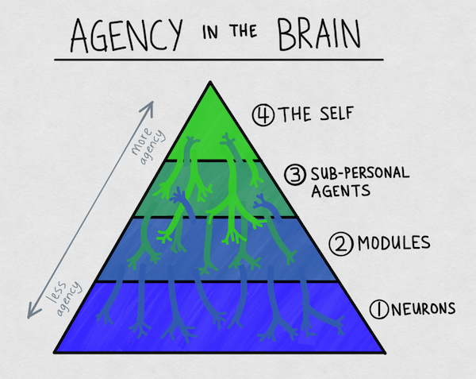
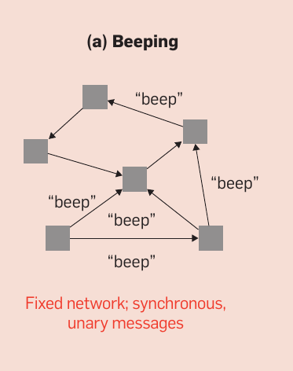
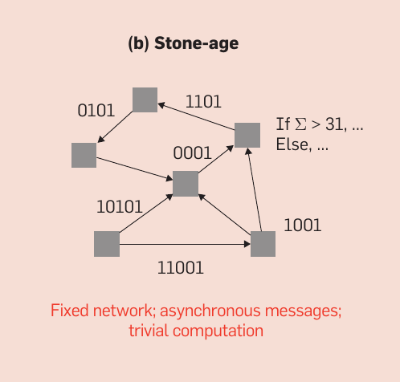
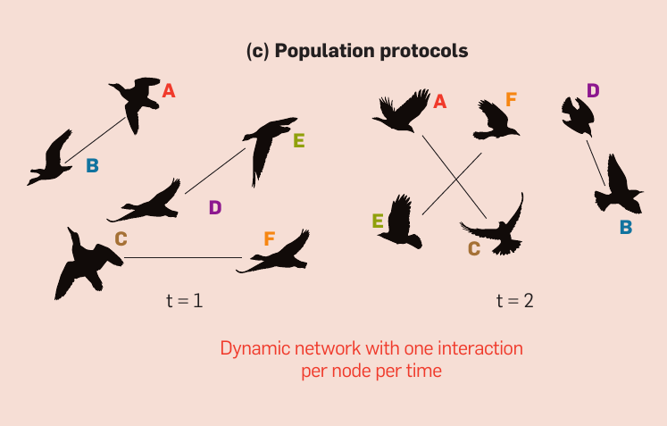
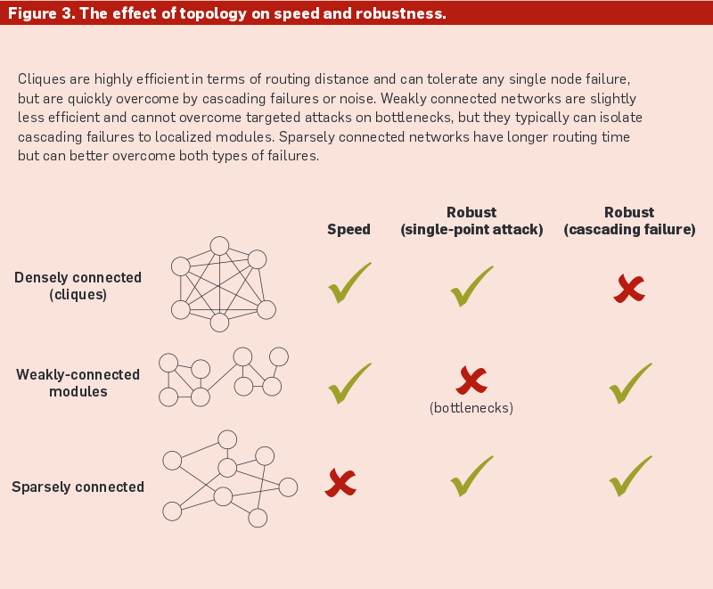

# nature's best practices for distributed systems

## hi

i'm [Mikey (@ahdinosaur)](http://dinosaur.is)

from [Enspiral](http://enspiral.com)

???

i have no idea what i'm saying

i will use imprecise terminology

life is hard to kill (try killing the fungus spores in your fridge)

- http://cacm.acm.org/magazines/2015/1/181614-distributed-information-processing-in-biological-and-computational-systems/abstract
- http://www.ribbonfarm.com/2015/03/04/gardens-need-walls-on-boundaries-ritual-and-beauty/
- http://networkcultures.org/unlikeus/resources/articles/what-is-a-federated-network/

## overview

- introduction
- natural networks
- global peer-to-peer networks
- local peer-to-peer networks

## introduction

### systems

- networks: who you connect to
- messages: what you say
- signals: how you connect

???

### coordination

>  Coordination problems are cases in which everyone agrees that a certain action would be best, but the free market cannot coordinate them into taking that action.

every intelligent person knows climate change is a problem to be solved.

yet we're not doing enough to solve it.

???

- http://www.raikoth.net/libertarian.html#coordination_problems

## central planning and control

common solution to coordination problem

## stigmergic and stochastic

> Most biological systems are distributed and must make decisions and respond to stimuli without a centralized coordinator and under severe constraints (energy conservation, limited communication range, limited messaging language, among others)

- http://cacm.acm.org/magazines/2015/1/181614-distributed-information-processing-in-biological-and-computational-systems/abstract
- https://en.wikipedia.org/wiki/Stigmergy

> A stochastic event or system is one that is unpredictable due to the influence of a random variable.

- https://en.wikipedia.org/wiki/Stochastic

## ants discover tcp

> A recent study demonstrated that with limited communication, ants solve the foraging problem by implementing a version of the Transmission Control Protocol (TCP), which is used on the Internet to determine available bandwidth when routing packets. If packet acknowledgments (ACKs) are received quickly, the sender assumes bandwidth is available and boosts transmission; but if ACKs are returned slowly, the sender assumes the network is congested and throttles down transmission. Similarly, the important factor for the ants is the rate of antennal contacts (a binary indicator) between ants currently in the nest and successful ants (with food) returning to the nest. If the rate of contact is high, it implies food in the environment is plentiful, and thus outgoing ants also leave the nest at a faster rate.

- http://cacm.acm.org/magazines/2015/1/181614-distributed-information-processing-in-biological-and-computational-systems/abstract
- http://priceonomics.com/the-independent-discovery-of-tcpip-by-ants/

## slime mold discover network routing

> Foraging slime molds have also been shown to adaptively adjust their networks of tubular junctions based on the distribution and availability of food sources in the area, which is typically unknown a priori. 52
> Slime molds also forage using breadth-first search using real cellular material, which is later pruned when optimal paths are found.  

- http://cacm.acm.org/magazines/2015/1/181614-distributed-information-processing-in-biological-and-computational-systems/abstract
- http://www.wired.com/2010/01/slime-mold-grows-network-just-like-tokyo-rail-system/

## networks

### hierarchy

alpha wolf is boss of pack, not 

large molecule doesn't get bonus and become organelle

### fractals

example: human organism -> organs -> tissues -> cells -> organelles -> large molecules -> small molecules -> atoms -> particles

???

blood-brain barrier protects brain from bad actors.

example: brains are composed of fractal agents

> For our purposes, an agent is an entity capable of autonomous, intelligent, goal-directed behavior.

> Thus there is, in this view, an internal 'economy' in the brain, in which neurons must compete with each other for resources. This design stands in contrast to the standard, Von Neumann computer architecture, whose parts never have to worry about where their energy is coming from. Without resource contention, there's no need for selfishness. And this is, in part, why computers are less flexible and adaptable — less plastic — than brains.

???

- http://www.meltingasphalt.com/neurons-gone-wild/
- https://blog.dinosaur.is/life-as-a-holon/
- Aida, K., Natsume, W. and Futakata, Y. Distributed computing with hierarchical master-worker paradigm for parallel branch and bound algorithm.  In Proceedings of the 31 st International Symposium on Cluster Computing and the Grid.  IEEE Computer Society, Washington, DC, 2003.  

## signals

### beeping

### stone-age

### population

## topology

instead of using sophisticated consensus algorithms, nature uses toplogical features to handle failures.

example: viruses, cells 

???

> In distributed computing, failures have primarily been handled by majority voting methods, 37 by using dedicated failure detectors, 25 or via cryptography.  41 In contrast, most biological systems rely on various network topological features to handle failures.

- http://cacm.acm.org/magazines/2015/1/181614-distributed-information-processing-in-biological-and-computational-systems/abstract

## 

## message strategies

> message sizes are usually one bit or of constant size indicting that unlike many traditional distributed algorithms, biological processes do not use such an identifier to label the sender and receiver

blockchain message gossip

- https://en.wikipedia.org/wiki/Gossip_protocol
- https://github.com/ssbc/scuttlebot
- https://github.com/substack/swarmbot

## problem with globals (social)

reality is neither objective nor global.

> Westerners, he says, prefer to understand things as mechanisms, while the Chinese prefer to understand things as organisms — and these are two very different kinds of processes.

- http://www.meltingasphalt.com/technical-debt-of-the-west/

reality is subjective and local.

- https://github.com/ssbc/secure-scuttlebutt/issues/86

## problems with globals (tech)

- Pakistani ISP uses BGP to blackhole internet
- CA certs and DNS are based on central registries
- easy to monitor who is downloading files on Bittorent
- winner-take-all effects of global networks (Uber)
- cost of Bitcoin global consensus is large amounts of duplicate CPU work in Proof-of-Work cycles
- cost of Ethereum global computation is large amounts of duplicate memory and CPU work in computation cycles
- distributed hash tables are easy to spam

## local > global

> On the biological side, as technology continues to improve and sheds light on molecular and cellular decision-making, we believe computational perspectives will be essential to understand how local, distributed rules give rise to robust, global systems.

- http://cacm.acm.org/magazines/2015/1/181614-distributed-information-processing-in-biological-and-computational-systems/abstract

global networks of ant colonies
global ecology

## example: peer-to-intermediatary-to-peer

i have phone, you have phone, we can't connect because base station is down.

## example: buying a bicycle

let's say i'm buying a bicycle from a neighbor.

why should i have to connect to some random strangers to participate in a global consensus process in order to send digital coins to my neighbor?

it's likely that i'm within a very few degrees of separation from my neighbor, i should gossip through this local network.

## systems in the past

## systems of the future

- networks: you connect to local agents (based on social or geographic proximity)
- messages: you say subjective statements
- signals: you use local gossip protocols

## example: B.A.T.M.A.N

https://en.wikipedia.org/wiki/B.A.T.M.A.N.

## example: secure-scuttlebutt / Patchwork

## thanks

:3

- [Patchwork](https://ssbc.github.io/patchwork): proof-of-concept for truly distributed social network
- [scuttlebot](https://scuttlebot.io): underlying peer-to-peer log store
- [Value Flows](https://valueflo.ws): protocols for fractal socio-economic systems

# notes

## agent trust networks

> @dominictarr: you just interact with your friends, etc, and following someone is basically saying "this user is a real human, not a bot, and not a scammer" That is a expression of trust. Sometimes they may make a mistake, and trust someone who turns out to be a jerk, for this reason, trust must be revokeable.
Thus, instead of just signing each other's keys (as in gpg) we need to be able to sign a variety of statements about those keys. Those keys must also sign statements about other things (posts, or links to external files etc) so that the statements about those external things are tied into a specific context.

- https://github.com/ssbc/secure-scuttlebutt/issues/65#issuecomment-64903674

> @mixmix: My favourite way of thinking about all this is that truly decentralised p2p is actually alarmingly similar to your everyday social interactions - no-one is really a boss, anyone can lie, trust matters, and you ignore stuff and people that have bad reputation.
Also, no-one can stop you talking with friends... and you don't need to be able to reach america to be able to talk

- http://hyper.mixmix.io/?source=https%253A%252F%252Fgithub.com%252Fmixmix%252Fblogposts%252Fblob%252Fmaster%252Funcapturable_distribution.md

## permaculture

- symbiotic relationships
  - companion planting (e.g. carrots with sage)
  - 1 + 1 = 3

## other links

- https://github.com/du5t/spaceship
