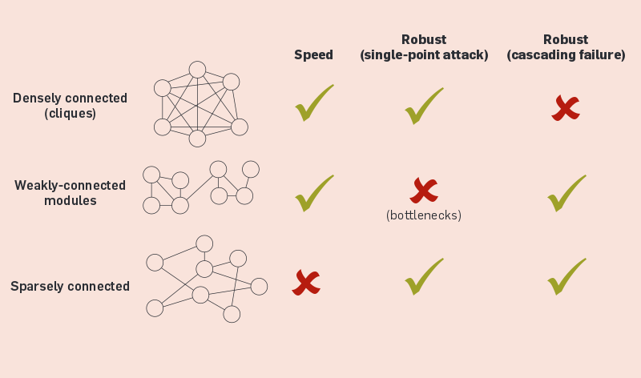

# nature's best practices for distributed systems

## hi

i'm [Mikey (@ahdinosaur)](http://dinosaur.is) from [Enspiral](http://enspiral.com)

  
  

slides are available at <http://dinosaur.is/campjs-vii>.

???

i have no idea what i'm saying

i will use imprecise terminology

much help from ["Distributed Information Processing in Biological and Computation Systems"](http://cacm.acm.org/magazines/2015/1/181614-distributed-information-processing-in-biological-and-computational-systems/abstract) paper

## overview

- introduction to systems
- natural systems
- global distributed systems
- local distributed systems

## introduction to systems

### systems 101

- networks: who you connect to
- messages: what you say
- signaling: how you connect

examples: 

- ecological systems
- socio-economic systems
- political systems

???

### why nature?

nature is better at distributed systems than we are.

???

life is hard to kill: try killing the fungus spores in your fridge

there's no question that the planet will survive climate change,

the question is whether we will.

### coordination problems

a [coordination problem](http://www.raikoth.net/libertarian.html#coordination_problems) is where:

- everyone agrees that certain actions would be best
- not everyone is coordinated in taking those actions

example: climate change

???

distributed systems can be seen as attempts to solve coordination problems

every intelligent person knows climate change is a problem to be solved.

yet we're not doing enough to solve it.

### [stigmergy](https://en.wikipedia.org/wiki/Stigmergy)

central planning and control is a common solution to coordination problems.

yet biological systems coordinate:

- without central control
- under severe constraints

???

> Most biological systems are distributed and must make decisions and respond to stimuli without a centralized coordinator and under severe constraints (energy conservation, limited communication range, limited messaging language, among others)

- http://cacm.acm.org/magazines/2015/1/181614-distributed-information-processing-in-biological-and-computational-systems/abstract

## natural systems

### simple over complex

???

rather than sophisticated synchronous protocols (like the OAuth dance),

most natural systems communicate with simple asynchronous messages

### randomized over deterministic

???

> A [stochastic](https://en.wikipedia.org/wiki/Stochastic) event or system is one that is unpredictable due to the influence of a random variable.

### beeping

fly brains specialize cells with Max Independent Set

???

beeping: 

- only message sent or received is a beep (unary signal)
- anonymous broadcast network where nodes have no knowledge of topology or size
- in each time slot, a node can either beep or be silent
- beeping nodes cannot determine if other nodes beeped as well
- silent nodes can only differentiate between no neighbors beeping or at least one neighbors beeping

fly brains: developing fly brains select a subset of cells to become sensory bristles on the fly's forehead.

- cell differentiation

### stone-age

???

- also anonymous network
- nodes can count up according to one-two-many principle

### example: slime mold

slime mold forages for food with a routing network

???

- forage for food using bread-first search with cellular material
- network adapts by pruning when optimal paths are found

### population

harvester ants forage for food with Transmission Control Protocol (TCP)

???

> A recent study demonstrated that with limited communication, ants solve the foraging problem by implementing a version of the Transmission Control Protocol (TCP), which is used on the Internet to determine available bandwidth when routing packets. If packet acknowledgments (ACKs) are received quickly, the sender assumes bandwidth is available and boosts transmission; but if ACKs are returned slowly, the sender assumes the network is congested and throttles down transmission. Similarly, the important factor for the ants is the rate of antennal contacts (a binary indicator) between ants currently in the nest and successful ants (with food) returning to the nest. If the rate of contact is high, it implies food in the environment is plentiful, and thus outgoing ants also leave the nest at a faster rate.

- http://cacm.acm.org/magazines/2015/1/181614-distributed-information-processing-in-biological-and-computational-systems/abstract
- http://priceonomics.com/the-independent-discovery-of-tcpip-by-ants/

### fractals

example:

- human organism
- <- organs
- <- tissues
- <- cells
- <- organelles
- <- large molecules
- <- small molecules
- <- atoms
- <- particles

???

- individual
- -> family
- -> village
- -> subhurb
- -> city
- -> region
- -> state

### example: human brain

brains are composed of fractal agents

???

> For our purposes, an agent is an entity capable of autonomous, intelligent, goal-directed behavior.

### [small worlds](https://en.wikipedia.org/wiki/Small-world_network)

???

a small-world network is where most nodes are not neighbors, but most nodes can be reached by every other node by a small number of hops

dense toplogies are used when little-to-no noise is expected, sparse toplogies are preferred when noise is expected.

examples:

- [Wikipedia game](http://thewikigame.com/)
- 6 degrees of Kevin Bacon
  - social influence networks
- activity-dependent plasticity of synapses
  - neural networks are shaped by environmental stimuli
  - input streams into the neural network and changes the toplogy of how it is processed

### handling failure

instead of using sophisticated consensus algorithms, nature uses toplogical features to handle failures.

???

sparse toplogies are less efficient, but more resilient as can isolate problems by changing toplogy.

example:

- protection against viruses
  - which is why viruses have evolved to interfere with activity of hub proteins such as p53

## global distributed networks

### example: internet service providers

> The very fabric of the Internet can be torn apart by a malicious ISP or even an honest mistake. On April 8th, 2010, an employee at China Telecom misconfigured a router - causing widespread Internet outages lasting up to fifteen minutes.

- [cjdns project goals](https://docs.meshwith.me/project-goals.html)

???

- Pakistani ISP uses BGP to blackhole internet

### example: global registries

CA certs and DNS are based on central registries.

Namecoin distributes the protocol, but not the registry.

???

- how do we deal with multiple nicknames in real life?

### example: mobile network providers

i have phone with a radio, you have phone with a radio, we can't connect because a base station is down.

peer -> middleman -> peer

### example: buying a bicycle with Bitcoin

let's say i'm buying a bicycle from a neighbor.

with Bitcoin, i have to send a message to random strangers (miners) to participate in a global consensus process.

???

- cost of Bitcoin global consensus is large amounts of duplicate CPU work in Proof-of-Work cycles
- within a very few degrees of trust separation from my neighbor, we could be doing local consensus
- cost of Ethereum global computation is large amounts of duplicate memory and CPU work in computation cycles

https://blog.dinosaur.is/global-vs-local-systems/

### example: downloading a file with Bittorrent

when i download a file with Bittorrent, i connect to random strangers.

this means it's easy to monitor who is downloading what.

### example: twitter abuse

since everyone is connected to everyone, there's no barrier to abusing someone on Twitter.

the victim (defender) is the one who has to expend energy rather than offender.

???

open by default

- also easy to spam
  - email
  - distributed hash tables

### example: monoculture

the world is converging on a uniform culture, at the expense of diversity.

- what narratives and metaphors do you use to express your world view?
- how might these bias or blind your thinking?

???

- endangered animals
- [endangered languages](https://github.com/RichardLitt/endangered-languages)
- [technical debt of the west](http://www.meltingasphalt.com/technical-debt-of-the-west/)

## local peer-to-peer networks

### why local?

> On the biological side, as technology continues to improve and sheds light on molecular and cellular decision-making, we believe computational perspectives will be essential to understand how local, distributed rules give rise to robust, global systems.

???

- planet ecology

### systems of the future

- networks: you connect to local agents (based on social or geographic proximity)
- messages: you say things subjective to your view
- signaling: you use gossip protocols to relay information

### local agents

- individual
- regional
  - subhurb
  - city
  - state
- professional
  - [family](https://github.com/enspiral-root-systems)
  - [community](http://devacademy.co.nz)
  - [network](http://enspiral.com)
- interests
  - [NodeSchool Wellington](http://nodeschool.io/wellington)
  - [Art~Hack](https://www.facebook.com/groups/714447698702058/)

### subjective views

- my friends call me Mikey
- my parents call me Michael
- i call myself dinosaur

???

- [subjective data structures](https://github.com/ssbc/secure-scuttlebutt/issues/86)

### [gossip protocols](https://en.wikipedia.org/wiki/Gossip_protocol)

relay a message through who's local to you.

example: i run into Alice in town. "hey what's the lastest you've heard from Bob?"

???

> [biological] message sizes are usually one bit or of constant size indicting that unlike many traditional distributed algorithms, biological processes do not use such an identifier to label the sender and receiver

blockchain message gossip

- https://github.com/ssbc/scuttlebot
- https://github.com/substack/swarmbot

### example: secure scuttlebutt (SSB)

peer-to-peer log store:
 
- each user has a feed associated with a public and private keypair
- each feed is a linked list of message signed with the associated private key
- messages can reference each other to create links (and indexes)
- each user gossips with who they "follow", and who those users "follow"
- public messages are plain JSON objects
- private messages with the public key of the intended recipient
  - try to decrypt to see if it is for you

### example: Patchwork

peer-to-peer social network:

- each user can create "about" messages for any other user (name, avatar, ...)
- any user can create "post" messages which provide Twitter / Facebook style communication

### example: [git-ssb](https://github.com/clehner/git-ssb)

decentralized GitHub!

### demos

## thanks

:3

- [Patchwork](https://ssbc.github.io/patchwork): proof-of-concept for truly distributed social network
- [scuttlebot](https://scuttlebot.io): underlying peer-to-peer log store
- [Value Flows](https://valueflo.ws): protocols for fractal socio-economic systems
